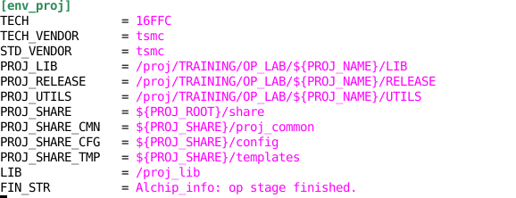
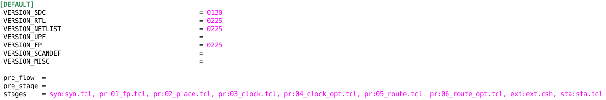

.. _config:

Config User Manual
========================================

Config types
----------------------------------------
Unix config files are the only interface between platform and users. The config files are different from projects(modules) to projects(modules). The option values of config files will influent the behavior of platform.

Unix config directory is often used for more complex configuration, which is composed by a set of config files.

``Config file types table in OP``:

+---------------+-------------------+-------------------------------------------------------------+
| config type   |  config file name | description                                                 |
+===============+===================+=============================================================+
| project       | proj.cfg          | project config file, user no need touch this file except PL |
+---------------+-------------------+-------------------------------------------------------------+
| library       | lib.cfg           | library filtering config file, select lib used for design   |
+---------------+-------------------+-------------------------------------------------------------+
| flow          | flow.cfg          | flow config file, used to define and control flow run       |
+---------------+-------------------+-------------------------------------------------------------+
| filter        | filter.cfg        | Filter config file, used to waive or detect Error messages  |
+---------------+-------------------+-------------------------------------------------------------+
|               | syn.cfg           | Synthesis config file, support DC/DCG..                     |
|               +-------------------+-------------------------------------------------------------+
|               | pr.cfg            | Place & Route config file, support ICC/ICC2/Innovus         |                                                         
| EDA tool      +-------------------+-------------------------------------------------------------+
|               | ext.cfg           | RC extraction config file, support StarRC/QRC               |
|               +-------------------+-------------------------------------------------------------+
|               | sta.cfg           | STA config file, support PT                                 |
|               +-------------------+-------------------------------------------------------------+
|               | fm.cfg            | Formal config file, support Formality/Conformal             |
|               +-------------------+-------------------------------------------------------------+
|               | pv.cfg            | PV config file, support OPUS/Calibre                        |
+---------------+-------------------+-------------------------------------------------------------+

OP has the those types of config files in both ``share/`` and ``block`` level.

Share level config files
^^^^^^^^^^^^^^^^^^^^^^^^^^^^^^^^^^^^^^^^^^^^^^
config files ``share/config`` is configed by PL, block's config values are comming from ``share/config`` by default.

- $PROJ_ROOT/share/config/proj.cfg::

  + project level only
  + project unique
  + op runtime environment variable configuration
  + library mapping src and dst directory configuration
  + pre-set directories in flow running

- $PROJ_ROOT/share/config/lib::

  + project level only
  + library mapping (library linking and library filtering) configuration
  + <type>.cfg (std.cfg, tech.cfg, etc.) is used for type linking from src to dst directory
  + liblist.cfg is used to filter the linked files above to generate liblist.tcl

- $PROJ_ROOT/share/config/lib.cfg::

  + project level overwritten by block level
  + default library filtering configuration

- $PROJ_ROOT/share/config/flow.cfg::

  + project level overwritten by block level
  + default flow configuration

- $PROJ_ROOT/share/config/flow::
  
  + project level instance overwritten by block level
  + used to update template to render target execution files
  + default template rendering configuration
  + EDA tool config files

- $PROJ_ROOT/share/config/filter.cfg::

  + project level overwritten by block level
  + default log parser key words configuration

Block level config files
^^^^^^^^^^^^^^^^^^^^^^^^^^^^^^^^^^^^^^^^^^^^^^
Block config files ``block/config`` is comming from ``share/config`` by default.

All the varialbes in block config files are start with "#", those variable's value are synchronized with ``share/config``.

:Example: #ocv_mode = true

Block owner can remove the "#", to overwritten the default value. Here is a more detail example in :ref:`ref_appendix_A_2`

- $BLK_ROOT/config/lib.cfg::

  + block level
  + real library filtering configuration

- $BLK_ROOT/config/flow.cfg::

  + block level
  + real flow configuration

- $BLK_ROOT/config/flow::

  + block level
  + used to update template to render target execution files
  + real template rendering configuration

- $BLK_ROOT/config/filter.cfg::

  + block level
  + real log parser key words configuration

Config file format
----------------------------------------

Standard unin ini format is used, which is the most widely used format by Linux tools and EDA tools, e.g. yum, apt-get, pip, git, svn, vcs, verdi etc.. The advantage of this kind of config format is the user-friendly, while the disadvantage is not suitable for complex data structure. But according to the KISS principle (keep it simple and stupid), it is better not using complex data structure in user configuration interface.

The component of this format is explained by taking the content of novas.conf in verdi as example:
::

   [qBaseWindowStateGroup]
   Verdi_1\qBaseWindowRestoreStateGroup\qDockerWindow_defaultLayout\qDockerWindow_restoreNewChildState=true
   
   [qBaseWindow_saveRestoreSession_group]
   10=/workspace/tools/yigy/cpu1/verification/zszx/output/zszx_sanity_test/1/verdiLog/novas_autosave.ses
   
   [qDockerWindow_C]
   Verdi_1\position.x=0
   Verdi_1\position.y=0
   Verdi_1\width=900
   Verdi_1\height=700

- the content marked by '[]' is called section, which represents a set of configurations
- each line including '=' in the section is called option, and the left and right part of '=' are called key and value of the option
- every config file is composed by several sections and options
- multiple values of the option is supported, and the values are split by ',' or newline

.. _ref_lib:

Config file proj.cfg
----------------------------------------
This project unique file is used to set the features of project level. It is recommended to modify by project leader and not block owner.
Most variables are pre-set, project leader no need touch many variables in this config file.

[example]  

- section ``[env_proj]`` , ``[env_blk]``

These two sections are about the op runtime environment variable settings, which is used to avoid the environment pollution. The environment variables are only available during op running and will be destroyed after the runtime

::

   TECH             : name of process node   
   TECH_VENDOR      : name of process tech vendor 
   STD_VENDOR       : name of process standard vendor
   PROJ_LIB         : project lib directory
   PROJ_RELEASE     : project initial input data RELEASE directory 
                      format ``date/file_type/file``, ex. 20180410/netlist/orange.v
   PROJ_UTILS       : project utility directory content whith all EDA tool's utility
   PROJ_SHARE       : project share directory
   PROJ_SHARE_CMN   : project common scripts used for all blocks
   PROJ_SHARE_CFG   : project share configuration file directory
   PROJ_SHARE_TMP   : project share template directory
   LIB              : source location of library and tech file
   FIN_STR          : this variable is used to configure the final target string recognized by op to consider the sub processing is finished normally. 
                      This variable should be printed in the end of normal templates.
   
   BLK_CFG          : Block configuration files directory
   BLK_CFG_FLOW     : blcok flow directory
   BLK_RTL          : block input rtl data directory
                      format ``block.v``
   BLK_VERIF        : block input verification data directory
   BLK_NETLIST      : block input netlist data directory
                      format ``block.v``
   BLK_FP           : block input floorplan data directory
                      format ``block.def.gz``
   BLK_SCANDEF      : block input scandef data directory
                      format ``block.scandef.gz``
   BLK_SDC          : block input sdc data directory
                      format ``block.mode.sdc``
   BLK_UPF          : block input upf data directory
                      format ``block.upf``
   BLK_MISC         : block other input data directory
   BLK_MODEL        : block input model data directory
   BLK_RELEASE      : block internal release directory
   BLK_RUN          : block run directory
                      run directory will not been push into project repo
   BLK_CMN          : block common scripts directory used for this block's all flow

- section ``[lib]`` 

Lib section is used to configure the library mapping source, destination and ignore pattern of each type (std, tech, etc.) This section define the standard cell, memory, IP, IO library source location and destination location, also define the ignored directory while doing "op admin -lib" file link stage.

::

  std              : standard cell library source location 
  std_dst          : standard cell library destination location
  std_ignore       : standard cell library ignore folders while linking
  tech             : tech file source location
  tech_dst         : tech file destination location
  io               : io library source location
  io_dst           : io library destination location
  io_ignore        : io library ignore folder while linking
  mem              : memory library source location
  mem_dst          : memory library destination location
  mem_ignore       : memory library ignore folder while linking
  ip               : ip library source location
  ip_dst           : ip library destination location
  ip_ignore        : ip library ignore folder while linking

- section ``[prex_dir]``

The option values of this section will be considered as flow pre-set directories, which will be made by software before flow running. The values follow the jinja2 template format, while the template variables are the same with flow template 'cur' part variables. And the keys of this section will be passed to the 'cur' part variables of flow template.

- section ``[prex_admin_dir]``

The option values of this section will be considered as project pre-set directories, which will be made by software during project setup by PL.

Config file flow.cfg
----------------------------------------
This config file is used for flow run configuration. All flow run will been record in this file, user can remove some unused flow sections as project goes on.
:ref:`ref_appendix_A_1`

- flow section 

    **format**
            [flow_name] 
    **description** 
            flow name is better been defined meaningful for future review. 
            flow name cannot be duplicated

- Input data VERSION

    **format**      
            input data version
    **description**
            version name should be the same as input data's version.
            ex. orange/fp/0101/orange.def.gz, to select 0101 version's floorplan file, fill ``VERSION_FP = 0101``
            input data version can be different for different flows.

- pre_flow

    **format**
            previous flow name 
    **description**
            fill with previous flow name to inherit it's config and plugin files.
            DEFAULT no need to inherit any one, so pre flow is empty.
            For the one need inherit and create branch from one substage, pre_flow and pre_stage is requied to filled.

- pre_stage

    **format**   
            previous stage:substage name
    **description**
            fill with previous stage:substage name to inherit it's config and plugin files.
            DEFAULT no need to inherit any one, so pre_stage is empty.
            For the one need inherit and create branch from one substage, pre_flow and pre_stage is requied to filled.
            
Config file filter.cfg
----------------------------------------
This config file is used for Error message waive and Error message detect.
Error message can be Error/Message/Information.

 + Keyword: ``waiver_keywords_exp`` used to waive Error message
 + Keyword: ``error_keywords_exp`` used to hightlight Error message
   
   Once Error detect in ``error_keywords_exp`` substage in flow will stop run.

   **How to resove Error meesage**
   
      1) User need manualy add Error message to ``waive_keywrods_exp`` to force substage pass Error
   
      2) User need fix Error then re-run the failed substage.

 More detail information please refer to :ref:`ref_error_filter`

Config directory lib
----------------------------------------
This config directory is used to set the library mapping options.

For more detail information about lib config please refer to here :ref:`lib_config`

Config directory flow
----------------------------------------
This config directory is used to set the EDA tool config files.
All EDA tool's config files and plugin files are contain in this directory.

::

  + $PROJ_ROOT/share/config/flow/syn.cfg
  + $PROJ_ROOT/share/config/flow/pr.cfg
  + $PROJ_ROOT/share/config/flow/ext.cfg
  + $PROJ_ROOT/share/config/flow/sta.cfg
  + $PROJ_ROOT/share/config/flow/fm.cfg
  + $PROJ_ROOT/share/config/flow/pv.cfg
  + $PROJ_ROOT/share/config/flow/ele.cfg
  + other EDA tool config files ...

For more detial information about eda tool config files please refer to here :ref:`eda_tool_config`

Using runner(op) to work
----------------------------------------
After setting the necessary configuration, we can make use of runner to start working. Please refer to the runner manual :ref:`runner`
