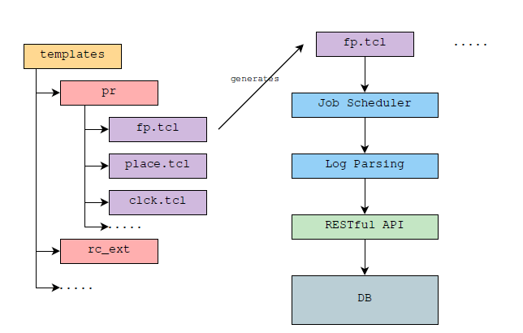
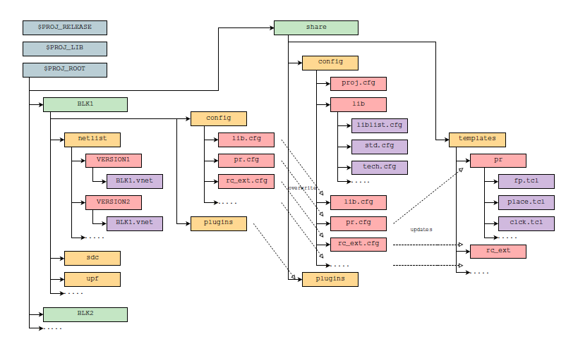

.. _runner:

Runner User Manual
========================================

**flow runner** 

OP initialization
----------------------------------------
Using module cmd to load op:

``$ module use /proj/onepiece4/modulefiles/dp``
``$ module load python_3.x.x``
``$ module load git_2.x.x``
``$ module load op_x.x.x``

Or directly source the op environment configuration file:

``$ source /proj/onepiece4/op_env.csh``

This cmd can be added to your own '~/.cshrc' for modules auto loading.

Sub command parameter mode
----------------------------------------
Almost all complex linux tools has the sub cmd parameter mode, e.g. yum, apt-get, git, svn etc.. The advantage of this mode is the features are classified by sub cmds, and making the platform more decoupled.

Taking the git as the example, we can use ``git --help`` to check all the sub cmds of git:
::

   git --help
   usage: git [--version] [--help] [-C <path>] [-c name=value]
              [--exec-path[=<path>]] [--html-path] [--man-path] [--info-path]
              [-p | --paginate | --no-pager] [--no-replace-objects] [--bare]
              [--git-dir=<path>] [--work-tree=<path>] [--namespace=<name>]
              <command> [<args>]
   
   These are common Git commands used in various situations:
   
   start a working area (see also: git help tutorial)
      clone      Clone a repository into a new directory
      init       Create an empty Git repository or reinitialize an existing one
   
   work on the current change (see also: git help everyday)
      add        Add file contents to the index
      mv         Move or rename a file, a directory, or a symlink
      reset      Reset current HEAD to the specified state
      rm         Remove files from the working tree and from the index
   
   examine the history and state (see also: git help revisions)
      bisect     Use binary search to find the commit that introduced a bug
      grep       Print lines matching a pattern
      log        Show commit logs
      show       Show various types of objects
      status     Show the working tree status
   
   grow, mark and tweak your common history
      branch     List, create, or delete branches
      checkout   Switch branches or restore working tree files
      commit     Record changes to the repository
      diff       Show changes between commits, commit and working tree, etc
      merge      Join two or more development histories together
      rebase     Reapply commits on top of another base tip
      tag        Create, list, delete or verify a tag object signed with GPG
   
   collaborate (see also: git help workflows)
      fetch      Download objects and refs from another repository
      pull       Fetch from and integrate with another repository or a local branch
      push       Update remote refs along with associated objects
   
   'git help -a' and 'git help -g' list available subcommands and some
   concept guides. See 'git help <command>' or 'git help <concept>'
   to read about a specific subcommand or concept.

In the content above, the git sub cmds include all from 'clone' to 'push', and each sub cmd is responsible for a set of feature-oriented operation, e.g. the 'clone' sub cmd is used for all related operation of cloning from code repository to local directory, and the behavior of 'clone' varies according to the following parameters.

All the parameters of sub cmd 'clone' can be checked by using ``git clone -h``:
::

   git clone -h
   usage: git clone [<options>] [--] <repo> [<dir>]
   
       -v, --verbose         be more verbose
       -q, --quiet           be more quiet
       --progress            force progress reporting
       -n, --no-checkout     don't create a checkout
       --bare                create a bare repository
       --mirror              create a mirror repository (implies bare)
       -l, --local           to clone from a local repository
       --no-hardlinks        don't use local hardlinks, always copy
       -s, --shared          setup as shared repository
       --recurse-submodules[=<pathspec>]
                             initialize submodules in the clone
       -j, --jobs <n>        number of submodules cloned in parallel
       --template <template-directory>
                             directory from which templates will be used
       --reference <repo>    reference repository
       --reference-if-able <repo>
                             reference repository
       --dissociate          use --reference only while cloning
       -o, --origin <name>   use <name> instead of 'origin' to track upstream
       -b, --branch <branch>
                             checkout <branch> instead of the remote's HEAD
       -u, --upload-pack <path>
                             path to git-upload-pack on the remote
       --depth <depth>       create a shallow clone of that depth
       --shallow-since <time>
                             create a shallow clone since a specific time
       --shallow-exclude <revision>
                             deepen history of shallow clone, excluding rev
       --single-branch       clone only one branch, HEAD or --branch
       --no-tags             don't clone any tags, and make later fetches not to follow them
       --shallow-submodules  any cloned submodules will be shallow
       --separate-git-dir <gitdir>
                             separate git dir from working tree
       -c, --config <key=value>
                             set config inside the new repository
       -4, --ipv4            use IPv4 addresses only
       -6, --ipv6            use IPv6 addresses only
    
E.g. '-v' parameter is used to print more info when running 'clone' sub cmds, while '-q' is to print none info. So the 'clone' sub cmd is only responsible for the related cloning operations, and the others will be owned by other sub cmds such as commit, push, etc.

Checking OP sub cmds
----------------------------------------
Our runner (OP) is exactly using the sub cmd mode mentioned above, so we can use ``op -h`` to check all its sub cmds:

::

   usage: op [-h] [-v] {admin,init,flow} ...
   
   positional arguments:
     {admin,init,flow}
       admin            sub cmd about kicking off project related actions
       init             sub cmd about generating initial project directories
       flow             sub cmd about running and controlling backend flows
   
   optional arguments:
     -h, --help         show this help message and exit
     -v                 show op version info and exit

Current OP all sub cmds:

- admin: used by PL to setup projects
- init: used by block owner and normal user to initialize the projects setup by PL
- flow: used to run and control flows configured

OP sub cmds parameters manual
----------------------------------------

Sub cmd admin
>>>>>>>>>>>>>>>>>>>>>>>>>>>>>>>>>>>>>>>>
- To check all parameters:

  + ``$ op admin -h``

- To list all available projects to be setup:

  + ``$ op admin -list``

- To list all available labs to be setup:

  + ``$ op admin -list_lab``

- To setup particular project (by PL):

  + ``$ op admin -p <PROJ>``

- To setup particular blocks in the project (by PL):

  + ``$ op admin -b <BLK1> <BLK2> ...``

- To update particular blocks in the project (by PL):

  + ``$ op admin -update_blk``
  + the cmd above is used to update all available blocks
  + ``$ op admin -update_blk <BLK1> <BLK2> ...``
  + the cmd above is used to update specified blocks
  + the updated blocks will have the latest input release files provided by PL

- To run library mapping (by PL):

  + ``$ op admin -lib``
  + library mapping is composed by two parts: library linking and library filtering

Sub cmd init
>>>>>>>>>>>>>>>>>>>>>>>>>>>>>>>>>>>>>>>>
- To check all parameters:

  + ``$ op init -h``

- To list all available projects to be initialized:

  + ``$ op init -list``

- To list all available labs to be initialized:

  + ``$ op init -list_lab``

- To initialize particular project:

  + ``$ op init -p <PROJ>``

Sub cmd flow
>>>>>>>>>>>>>>>>>>>>>>>>>>>>>>>>>>>>>>>>
- To check all parameters:

  + ``$ op flow -h``

- To list all runtime environment variables during flow running:

  + ``$ op flow -list_env``

- To list all available blocks:

  + ``$ op flow -list_blk``

- To list all flows and their stages and sub stages:

  + ``$ op flow -list_flow``
  + flow has inheriting features, which will also be shown
  + the format is <flow>::<stage>:<sub_stage>:<multi_inst>

- To initialize particular flow:

  + ``$ op flow -init <FLOW1> <FLOW2> ...``
  + the flow configuration will be inherited from its parent flow
  + the flow relationship is configured in flow.cfg

- To generate particular flow execution files:

  + ``$ op flow -gen <FLOW1> <FLOW2> ...``
  + only generating without running
  + if no flow name is given, the DEFAULT flow files will be generated
  + run in block directory only

- To run particular flow:

  + ``$ op flow -run <FLOW1> <FLOW2> ...``
  + if no flow name is given, the DEFAULT flow will be run
  + run in block directory only

- To run flow mandatorily:

  + ``$ op flow -run <FLOW1> <FLOW2> ... -force``
  + op flow has the pass-skip feature, which is op will skip the last passed sub stage if no modification in generated files
  + this option is used to run flow no matter it was passed or not
  + ``$ op flow -run <FLOW1> <FLOW2> ... -force <flow>::<stage>:<sub_stage>:<multi_inst>``
  + if the particular sub_stage is specified in force parameter, the sub_stage and its following stages will be run mandatorily
  + run in block directory only

- To run flow from a particular sub_stage:

  + ``$ op flow -run <FLOW1> <FLOW2> ... -begin <flow>::<stage>:<sub_stage>:<multi_inst>``
  + the flow will run from the particular sub_stage no matter the status of previous stages
  + run in block directory only

- To run flow without re-generating liblist.tcl:

  + ``$ op flow -run <FLOW1> <FLOW2> ... -no_lib``
  + the flow will run without re-doing library filtering.
  + run in block directory only

- To run flow with a comment string:

  + ``$ op flow -run <FLOW1> <FLOW2> ... -c "<COMMENT>"``
  + the flow will run with the comment string, which will be shown in the web I/F of platform
  + this feature is useful for distinguish flows easily
  + run in block directory only

- To show all stage variables passed to Jinja2 templates:

  + ``$ op flow -show_var``
  + the shown list dictionary data structure demonstrates all the variables used by flow templates
  + often used by template composer
  + run in block directory only

- To restore particular sub_stage:

  + ``$ op flow -restore <flow>::<stage>:<sub_stage>:<multi_inst>``
  + this option is used to restore the particular sub_stage for EDA tool

Platform directory hierarchy
----------------------------------------
This section introduces the related directory hierarchy of platform.

PROJ_ROOT/share/config/
>>>>>>>>>>>>>>>>>>>>>>>>>>>>>>>>>>>>>>>>
The main directory of project level config
::

   config
   ├── filter.cfg
   ├── flow
   │   ├── eco.cfg
   │   ├── ext.cfg
   │   ├── fm.cfg
   │   ├── plugins/
   │   ├── pr.cfg
   │   ├── pv.cfg
   │   ├── signoff.cfg
   │   ├── spg.cfg
   │   ├── sta.cfg
   │   └── syn.cfg
   ├── flow.cfg
   ├── lib
   │   ├── io.cfg
   │   ├── ip.cfg
   │   ├── liblist.cfg
   │   ├── mem.cfg
   │   ├── std.cfg
   │   └── tech.cfg
   ├── lib.cfg
   └── proj.cfg

PROJ_ROOT/BLK_ROOT
>>>>>>>>>>>>>>>>>>>>>>>>>>>>>>>>>>>>>>>>
The main directory of BLK_ROOT
::

   BLK_ROOT

If no specified file configured, the generated execution files will follow the default value in share/config to be rendered.

Platform development announcement
----------------------------------------
OP is under active development, and maybe have feature modification.
Welcome to try our OP platform, and any questions or suggestions about platform, please contact **guanyu_yi@alchip.com**
