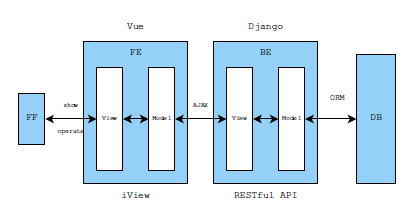
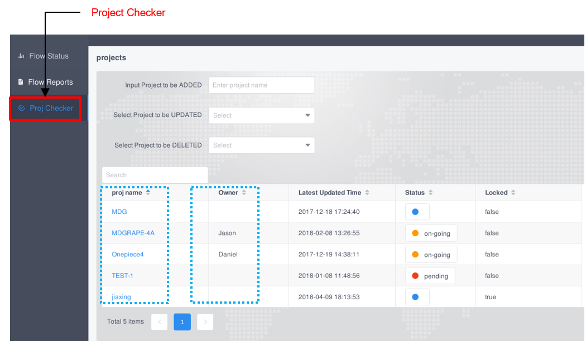

.. _web:

Web Architecture Introduction
========================================
Platform web part is used to cooperated with runner to provide more powerful features, meanwhile it is a data center, and all the flow running key information will be collected and shown by web part.

Database
----------------------------------------
A SQL Server built on PostgreSQL, and all possible information will be collected here.

Web Framework
----------------------------------------
A web framework built on Django, Vue, iView, and all demostration of data, documents, analysis, etc. will be done here.

How to access platform web
----------------------------------------
Visiting http://op.alchip.com.cn:8000 to open platform home in EoD linux.

    .. figure:: images/INDEX.png
                
                home page

Enter your AD password, same as git password.

   .. figure:: images/login_window.PNG

By using the home page, we can navigate several SPAs (single page applications) in the left column.

.. Note::
   Contact IT if you cannot login OP web.

SPA Flow Status
----------------------------------------
Flow status record every user's ``1 week`` run history. User can easily find the run job status and job process with Flow status page.

- Flow status overview page

  .. figure:: images/web_status.PNG

- Flow status flow page

  .. figure:: images/op_status_1.PNG

SPA Flow Reports
----------------------------------------
Flow Reports record every user's ``all`` history reports. User can easily find the run job report with Flow Reports page.

- Flow Reports project page
 
  .. figure:: images/op_report.PNG

- Flow Reports block page

  .. figure:: images/op_report_1.PNG

- Flow Reports flow page

  .. figure:: images/op_report_2.PNG

- FLOW Reports sub_stage page

  .. figure:: images/op_report_2_1.PNG

- FLOW Reports quick detail report view bottom
 
  .. figure:: images/op_report_3.PNG

SPA Proj Checker
----------------------------------------
Porj Checker is used for project status check.

Platform development announcement
----------------------------------------
OP is under active development, and maybe have feature modification.
Welcome to try our OP platform, and any questions or suggestions about platform, please contact **guanyu_yi@alchip.com**
